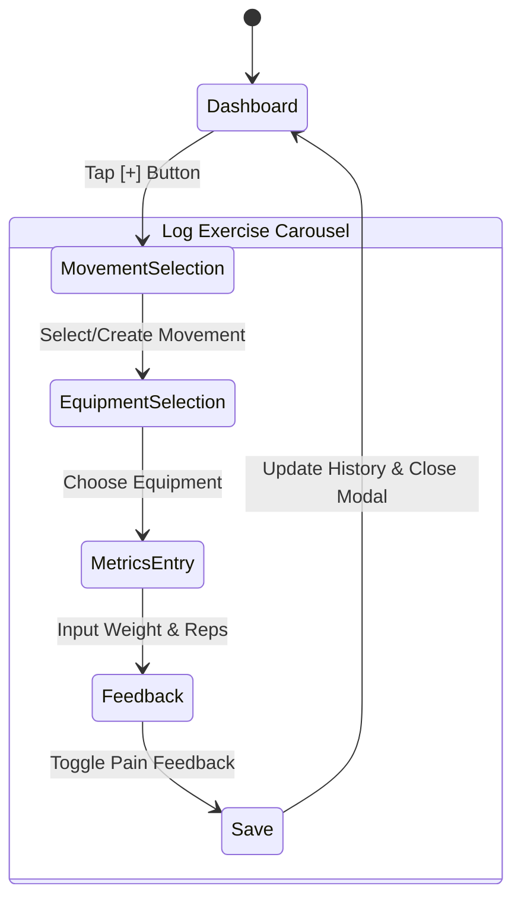
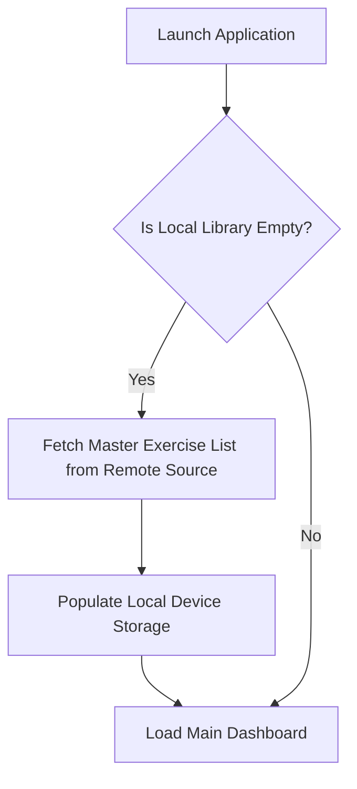
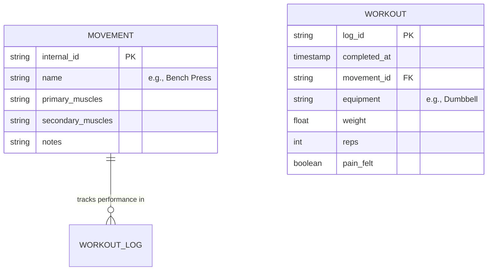

Here is the `gemini.md` file detailing the product and user flows without the underlying technical stack mentions. 

***

# Product Specification: Frictionless Fitness Tracker

## 1. App Overview
This is a mobile-friendly, single-page application designed for high-speed, frictionless logging of gym exercises. The core philosophy is to minimize the time between completing a set and recording the data. It tracks individual movements, associated metrics (weight, reps, equipment), and qualitative feedback (pain), keeping all historical data stored locally on the user's device for immediate access and privacy.

---

## 2. Core User Interface

The primary interface is a single scrolling page comprising three main sections:

### **Top App Bar**
* Displays the application title.

### **Search & Action Bar**
* **Sticky Search:** A persistent search bar used to instantly filter the workout history. Typing an exercise name (e.g., "Bench") filters the timeline to show only that movement while maintaining the chronological grouping. This allows users to quickly scan their recent performances.
* **Quick Add Action:** A prominent **[+]** button positioned to the right of the search bar to initiate a new log entry.

### **Workout History Table**
* **Chronological Grouping:** Data is organized into chunks by date (e.g., "Today", "Yesterday", "Oct 24, 2023").
* **Entry Rows:** Each row represents a single completed set, displaying:
    * Movement Name
    * Equipment Used
    * Weight and Reps
    * Pain Indicator (A visual warning icon if pain was recorded during the set).

---

## 3. The "Log Exercise" Flow

To keep the interface uncluttered, adding a new entry opens a modal carousel window. Navigation through this window is step-by-step and strictly guided.

### **Step 1: Movement Selection**
* **Search Interface:** A large auto-focused text field sits above a list of recently performed movements.
* **Frictionless Inline Creation:** If a user searches for a movement that does not exist in their library, a dynamic button appears at the bottom of the list (e.g., `[+] Add "Bulgarian Split Squat" as a new movement`). Tapping this instantly saves the new movement and advances to the next step without breaking the user's flow.

### **Step 2: Equipment Selection**
* **Quick Selection:** A grid of easily tappable chips for common equipment types (Dumbbell, Barbell, Cables, Machine, Bodyweight, etc.). A single tap locks in the choice and advances the screen.

### **Step 3: Metrics (Weight & Reps)**
* **Data Entry:** Two large, mobile-optimized number input fields for Weight and Reps.
* **Contextual Hint:** A small text hint appears (e.g., *"Last time: 135 lbs x 8 reps"*) based on the user's most recent performance of the selected exercise. This allows users to make informed progression decisions without leaving the screen.

### **Step 4: Feedback & Save**
* **Pain Tracking:** A simple prompt asks about abnormal pain, featuring two large "Yes/No" toggle buttons.
* **Completion:** Selecting an option activates the "Save Set" button. Saving commits the entry to the daily log and returns the user to the main dashboard.

---

## 4. Application Initialization & Data Loading

To ensure users have immediate utility upon their first launch, the app features an automatic onboarding data sync. 

---

## 5. Data Architecture (Conceptual)

The application relies on two primary data structures linked together to track historical progress.

