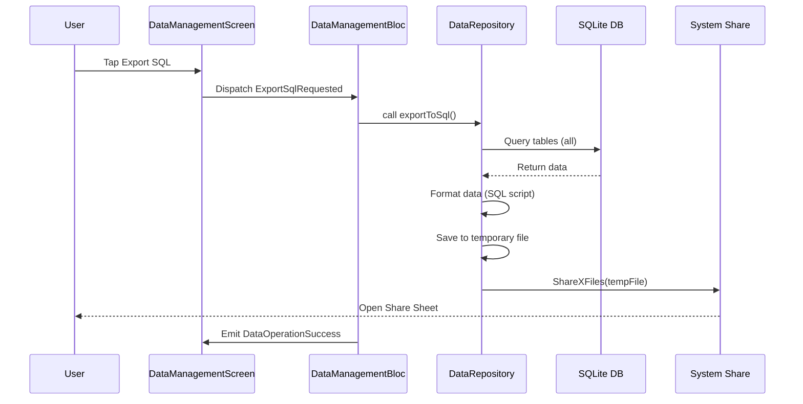
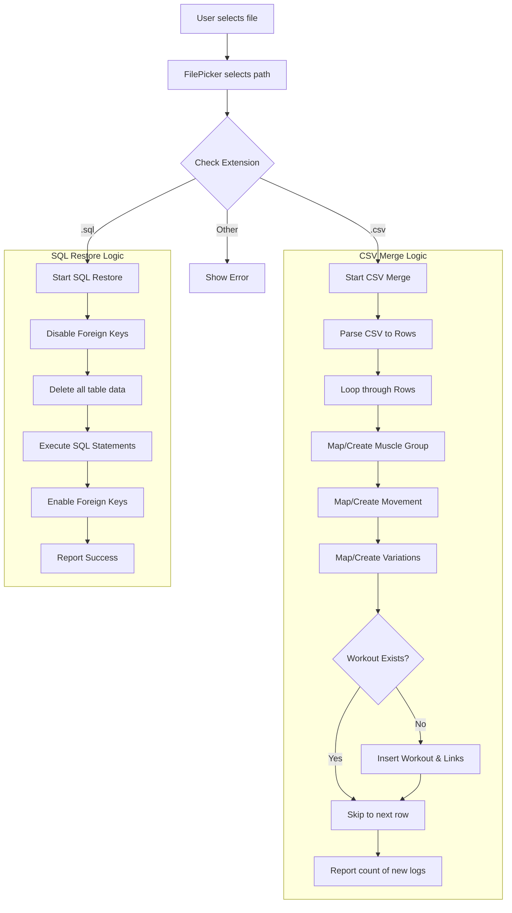
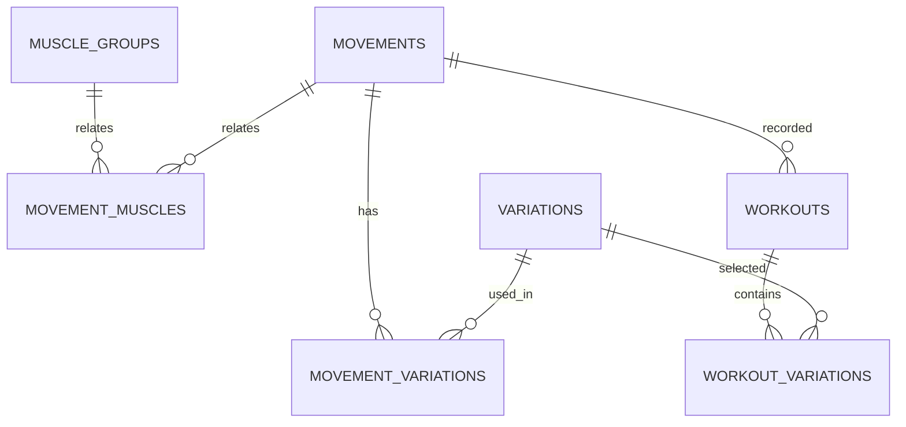

# Import/Export Feature Specification

This document details the reverse-engineered implementation of the Import/Export functionality in the Simple Gym Tracker application.

## Overview

The application supports data management workflows focused on full database backup and restoration.

---

## 1. Export Functionality

### SQL Export
Generates a full schema-compatible backup.

*   **Logic**: Iterates through all system tables and generates `INSERT INTO` statements.
*   **Format**: Standard SQL script with `PRAGMA foreign_keys=OFF`.
*   **Delivery**: Saves to a temporary file and triggers the system share sheet.

### Export Flow (Mermaid)

---

## 2. Import Functionality

### CSV Import (Merge Logic)
Imports workout logs without overwriting the entire database. It "merges" data by creating missing entities and skipping duplicates.
*Note: Currently maintained for potential future use or manual imports, but CSV Export is disabled.*

*   **Entity Mapping**: Automatically maps muscle groups, movements, and variations by name (case-insensitive).
*   **Deduplication**: Checks if a workout with the same `timestamp`, `movement_id`, `weight`, and `reps` already exists.
*   **Transaction**: Wrapped in a single database transaction for atomicity.

### SQL Import (Restore Logic)
Performs a destructive "wipe and reload" of the database.

*   **Logic**: 
    1. Disables foreign keys.
    2. Deletes all data from all tables (in order of dependency).
    3. Executes `INSERT` statements from the SQL file.
    4. Re-enables foreign keys.
*   **Warning**: This replaces the current database entirely.

### Import Flow (Mermaid)

---

## 3. Data Schema Dependencies

The following tables are involved in the import/export process:

1.  `muscle_groups`
2.  `movements`
3.  `movement_muscles`
4.  `variations`
5.  `movement_variations`
6.  `workouts`
7.  `workout_variations`
8.  `settings`

### Database Relationships (Mermaid)

---

## 4. Implementation Details

### DataRepository (lib/data/repositories/data_repository.dart)
The engine of the feature. It uses `sqflite` for DB operations, `csv` for parsing, and `path_provider` for file handling.

### DataManagementBloc (lib/features/dashboard/viewmodels/data_management_bloc.dart)
The state manager. It coordinates the `FilePicker` and communicates progress/results back to the UI.
